# How Ink Notebook works – diagrams of every flow

These diagrams follow the code in `src/`: `src/core` holds the pure logic (unit tested), `src/ink` the pen engine (DOM only), `src/obsidian` and `src/main.ts` the Obsidian integration. GitHub and Obsidian both draw the Mermaid blocks below.

1. [The big picture](#1-the-big-picture)
2. [Starting the plugin](#2-starting-the-plugin)
3. [The two files of an ink page](#3-the-two-files-of-an-ink-page)
4. [Opening a file: ink view or Markdown view](#4-opening-a-file-ink-view-or-markdown-view)
5. [Writing: from the pen to the file](#5-writing-from-the-pen-to-the-file)
6. [What starts a transcription](#6-what-starts-a-transcription)
7. [Ink → text: the transcription pipeline](#7-ink--text-the-transcription-pipeline)
8. [Handwriting recognition of one writing area](#8-handwriting-recognition-of-one-writing-area)
9. [Page status and the offline queue](#9-page-status-and-the-offline-queue)
10. [Flipping between ink and text](#10-flipping-between-ink-and-text)
11. [Keeping your edits on the text page](#11-keeping-your-edits-on-the-text-page)
12. [The text page: live figures, bookmarks, typed notes](#12-the-text-page-live-figures-bookmarks-typed-notes)
13. [Creating ink pages](#13-creating-ink-pages)
14. [Renaming, moving and deleting](#14-renaming-moving-and-deleting)
15. [PDFs, pictures and papers from arXiv](#15-pdfs-pictures-and-papers-from-arxiv)
16. [Lasso actions, object library and Mermaid diagrams](#16-lasso-actions-object-library-and-mermaid-diagrams)
17. [Settings, setup assistant and e-ink mode](#17-settings-setup-assistant-and-e-ink-mode)
18. [Converting pages made with Excalidraw](#18-converting-pages-made-with-excalidraw)

---

## 1. The big picture

Who talks to whom. The plugin (`InkNotebookPlugin` in `src/main.ts`) creates every service and wires them to Obsidian's events; the pen engine knows nothing about Obsidian; the core is pure functions.

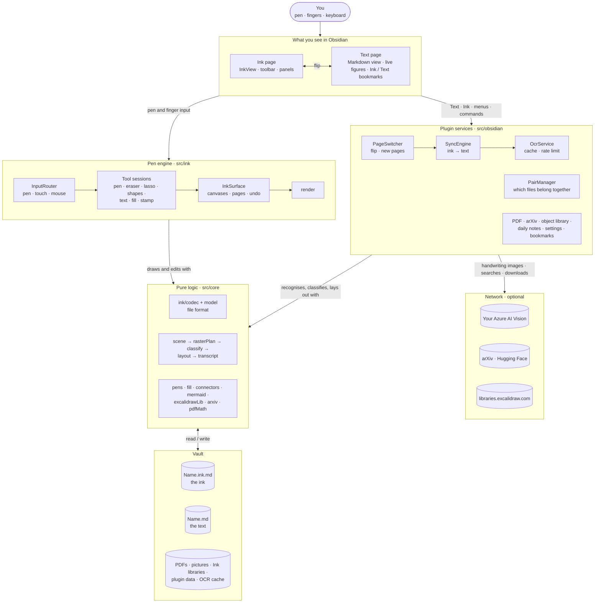
```mermaid
flowchart TB
  user(["You<br/>pen · fingers · keyboard"])

  subgraph screens["What you see in Obsidian"]
    direction LR
    inkpage["Ink page<br/>InkView · toolbar · panels"]
    textpage["Text page<br/>Markdown view · live figures · Ink / Text bookmarks"]
    inkpage <-->|"flip"| textpage
  end

  subgraph engine["Pen engine · src/ink"]
    direction LR
    input["InputRouter<br/>pen · touch · mouse"] --> tools["Tool sessions<br/>pen · eraser · lasso · shapes ·<br/>text · fill · stamp"] --> surface["InkSurface<br/>canvases · pages · undo"] --> render["render"]
  end

  subgraph services["Plugin services · src/obsidian"]
    direction LR
    switcher["PageSwitcher<br/>flip · new pages"] --> sync["SyncEngine<br/>ink → text"] --> ocr["OcrService<br/>cache · rate limit"]
    pairs["PairManager<br/>which files belong together"]
    more["PDF · arXiv · object library ·<br/>daily notes · settings · bookmarks"]
  end

  subgraph core["Pure logic · src/core"]
    direction LR
    codec["ink/codec + model<br/>file format"]
    pipeline["scene → rasterPlan → classify →<br/>layout → transcript"]
    kit["pens · fill · connectors · mermaid ·<br/>excalidrawLib · arxiv · pdfMath"]
  end

  subgraph files["Vault"]
    direction LR
    inkfile[("Name.ink.md<br/>the ink")]
    textfile[("Name.md<br/>the text")]
    other[("PDFs · pictures · Ink libraries ·<br/>plugin data · OCR cache")]
  end

  subgraph net["Network · optional"]
    direction LR
    az[("Your Azure AI Vision")]
    arx[("arXiv · Hugging Face")]
    exl[("libraries.excalidraw.com")]
  end

  user --> screens
  screens -->|"pen and finger input"| engine
  screens -->|"Text · Ink · menus · commands"| services
  engine -->|"draws and edits with"| core
  services -->|"recognises, classifies, lays out with"| core
  core <-->|"read / write"| files
  services -->|"handwriting images · searches · downloads"| net
```

---

## 2. Starting the plugin

`onload()` in `src/main.ts`, then `onLayoutReady()`.

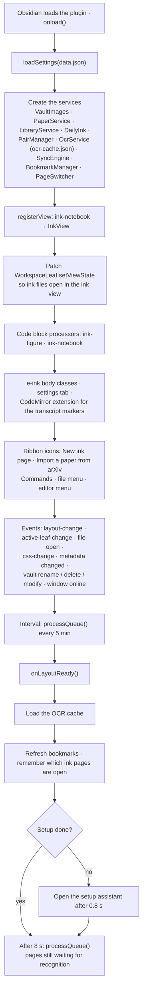
```mermaid
flowchart TD
  A["Obsidian loads the plugin · onload()"] --> B["loadSettings(data.json)"]
  B --> C["Create the services<br/>VaultImages · PaperService · LibraryService · DailyInk ·<br/>PairManager · OcrService (ocr-cache.json) · SyncEngine ·<br/>BookmarkManager · PageSwitcher"]
  C --> D["registerView: ink-notebook → InkView"]
  D --> E["Patch WorkspaceLeaf.setViewState<br/>so ink files open in the ink view"]
  E --> F["Code block processors: ink-figure · ink-notebook"]
  F --> G["e-ink body classes · settings tab ·<br/>CodeMirror extension for the transcript markers"]
  G --> H["Ribbon icons: New ink page · Import a paper from arXiv<br/>Commands · file menu · editor menu"]
  H --> I["Events: layout-change · active-leaf-change · file-open ·<br/>css-change · metadata changed ·<br/>vault rename / delete / modify · window online"]
  I --> J["Interval: processQueue() every 5 min"]
  J --> K["onLayoutReady()"]
  K --> L["Load the OCR cache"]
  L --> M["Refresh bookmarks · remember which ink pages are open"]
  M --> N{"Setup done?"}
  N -- no --> O["Open the setup assistant after 0.8 s"]
  N -- yes --> P["After 8 s: processQueue()<br/>pages still waiting for recognition"]
  O --> P
```

---

## 3. The two files of an ink page

Every ink page is two Markdown files linked both ways through their properties (`src/obsidian/pairs.ts`, `src/core/ink/codec.ts`, `src/core/transcript.ts`).

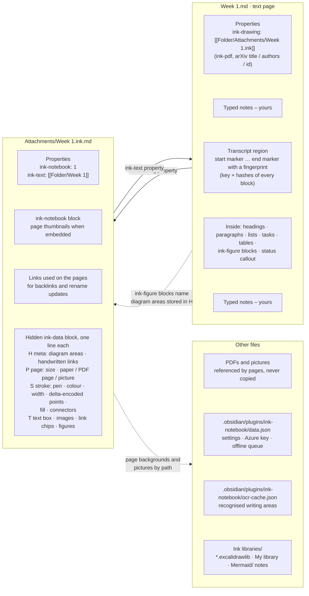
```mermaid
flowchart LR
  subgraph text["Week 1.md · text page"]
    direction TB
    t1["Properties<br/>ink-drawing: [[Folder/Attachments/Week 1.ink]]<br/>(ink-pdf, arXiv title / authors / id)"]
    t2["Typed notes – yours"]
    t3["Transcript region<br/>start marker … end marker with a fingerprint<br/>(key + hashes of every block)"]
    t4["Inside: headings · paragraphs · lists · tasks · tables ·<br/>ink-figure blocks · status callout"]
    t5["Typed notes – yours"]
    t1 ~~~ t2 ~~~ t3 ~~~ t4 ~~~ t5
  end

  subgraph ink["Attachments/Week 1.ink.md"]
    direction TB
    i1["Properties<br/>ink-notebook: 1<br/>ink-text: [[Folder/Week 1]]"]
    i2["ink-notebook block<br/>page thumbnails when embedded"]
    i3["Links used on the pages<br/>for backlinks and rename updates"]
    i4["Hidden ink-data block, one line each<br/>H meta: diagram areas · handwritten links<br/>P page: size · paper / PDF page / picture<br/>S stroke: pen · colour · width · delta-encoded points ·<br/>fill · connectors<br/>T text box · images · link chips · figures"]
    i1 ~~~ i2 ~~~ i3 ~~~ i4
  end

  subgraph other["Other files"]
    direction TB
    o1["PDFs and pictures<br/>referenced by pages, never copied"]
    o2[".obsidian/plugins/ink-notebook/data.json<br/>settings · Azure key · offline queue"]
    o3[".obsidian/plugins/ink-notebook/ocr-cache.json<br/>recognised writing areas"]
    o4["Ink libraries/<br/>*.excalidrawlib · My library · Mermaid/ notes"]
    o1 ~~~ o2 ~~~ o3 ~~~ o4
  end

  text -->|"ink-drawing property"| ink
  ink -->|"ink-text property"| text
  text -.->|"ink-figure blocks name<br/>diagram areas stored in H"| ink
  ink -.->|"page backgrounds and<br/>pictures by path"| other
```

---

## 4. Opening a file: ink view or Markdown view

Ink pages are Markdown files, so Obsidian would open them as text. `viewPatch.ts` redirects them; `InkView` double-checks (`src/obsidian/inkView.ts`).

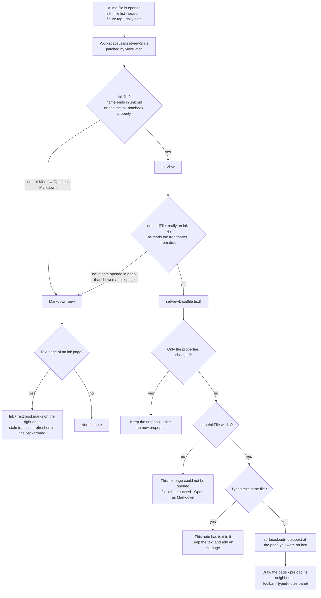
```mermaid
flowchart TD
  A["A .md file is opened<br/>link · file list · search · figure tap · daily note"] --> B["WorkspaceLeaf.setViewState<br/>patched by viewPatch"]
  B --> C{"Ink file?<br/>name ends in .ink.md<br/>or has the ink-notebook property"}
  C -- "no · or More → Open as Markdown" --> MD["Markdown view"]
  MD --> MD2{"Text page of an ink page?"}
  MD2 -- yes --> MD3["Ink / Text bookmarks on the right edge<br/>stale transcript refreshed in the background"]
  MD2 -- no --> MD4["Normal note"]
  C -- yes --> IV["InkView"]
  IV --> D{"onLoadFile: really an ink file?<br/>re-reads the frontmatter from disk"}
  D -- "no: a note opened in a tab that showed an ink page" --> MD
  D -- yes --> E["setViewData(file text)"]
  E --> F{"Only the properties changed?"}
  F -- yes --> F2["Keep the notebook, take the new properties"]
  F -- no --> G{"parseInkFile works?"}
  G -- no --> G2["This ink page could not be opened<br/>file left untouched · Open as Markdown"]
  G -- yes --> H{"Typed text in the file?"}
  H -- yes --> H2["This note has text in it<br/>Keep the text and add an ink page"]
  H -- no --> I["surface.load(notebook) at the page you were on last"]
  I --> J["Draw the page · preload its neighbours ·<br/>toolbar · typed-notes panel"]
```

---

## 5. Writing: from the pen to the file

`InputRouter` (`src/ink/input.ts`) decides what a pointer does; tool sessions (`src/ink/tools.ts`) change the page; `InkSurface` (`src/ink/surface.ts`) commits, redraws and tells `InkView`, which saves when the pen rests.

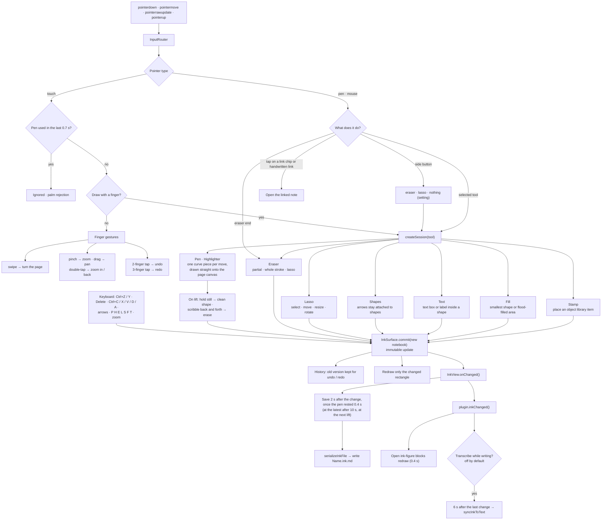
```mermaid
flowchart TD
  P["pointerdown · pointermove · pointerrawupdate · pointerup"] --> R["InputRouter"]
  KB["Keyboard: Ctrl+Z / Y · Delete · Ctrl+C / X / V / D / A ·<br/>arrows · P H E L S F T · zoom"] --> SURF
  R --> K{"Pointer type"}
  K -- touch --> PR{"Pen used in the last 0.7 s?"}
  PR -- yes --> IGN["Ignored · palm rejection"]
  PR -- no --> FD{"Draw with a finger?"}
  FD -- yes --> TS
  FD -- no --> G["Finger gestures"]
  G --> G1["swipe → turn the page"]
  G --> G2["pinch → zoom · drag → pan<br/>double-tap → zoom in / back"]
  G --> G3["2-finger tap → undo<br/>3-finger tap → redo"]
  K -- "pen · mouse" --> TF{"What does it do?"}
  TF -- "eraser end" --> ER
  TF -- "side button" --> SB["eraser · lasso · nothing (setting)"]
  SB --> TS
  TF -- "tap on a link chip or handwritten link" --> LNK["Open the linked note"]
  TF -- "selected tool" --> TS["createSession(tool)"]
  TS --> PEN["Pen · Highlighter<br/>one curve piece per move,<br/>drawn straight onto the page canvas"]
  TS --> ER["Eraser<br/>partial · whole stroke · lasso"]
  TS --> LA["Lasso<br/>select · move · resize · rotate"]
  TS --> SH["Shapes<br/>arrows stay attached to shapes"]
  TS --> TX["Text<br/>text box or label inside a shape"]
  TS --> FI["Fill<br/>smallest shape or flood-filled area"]
  TS --> ST["Stamp<br/>place an object library item"]
  PEN --> SMART["On lift: hold still → clean shape ·<br/>scribble back and forth → erase"]
  SMART --> SURF
  ER --> SURF
  LA --> SURF
  SH --> SURF
  TX --> SURF
  FI --> SURF
  ST --> SURF
  SURF["InkSurface.commit(new notebook)<br/>immutable update"] --> HI["History: old version kept for undo / redo"]
  SURF --> RD["Redraw only the changed rectangle"]
  SURF --> CH["InkView.onChanged()"]
  CH --> SV["Save 2 s after the change, once the pen rested 0.4 s<br/>(at the latest after 10 s, at the next lift)"]
  SV --> SER["serializeInkFile → write Name.ink.md"]
  CH --> IC["plugin.inkChanged()"]
  IC --> LIS["Open ink-figure blocks redraw (0.4 s)"]
  IC --> AT{"Transcribe while writing?<br/>off by default"}
  AT -- yes --> T6["6 s after the last change → syncInkToText"]
```

---

## 6. What starts a transcription

Every path ends in `SyncEngine.syncInkToText`, which runs one job per ink page at a time.

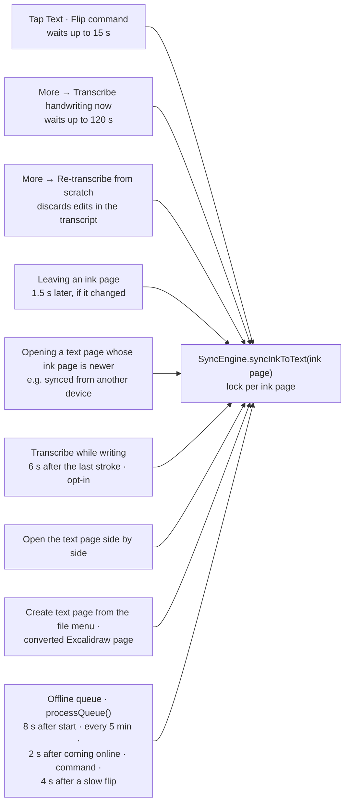
```mermaid
flowchart LR
  T1["Tap Text · Flip command<br/>waits up to 15 s"] --> S
  T2["More → Transcribe handwriting now<br/>waits up to 120 s"] --> S
  T3["More → Re-transcribe from scratch<br/>discards edits in the transcript"] --> S
  T4["Leaving an ink page<br/>1.5 s later, if it changed"] --> S
  T5["Opening a text page whose ink page is newer<br/>e.g. synced from another device"] --> S
  T6["Transcribe while writing<br/>6 s after the last stroke · opt-in"] --> S
  T7["Open the text page side by side"] --> S
  T8["Create text page from the file menu ·<br/>converted Excalidraw page"] --> S
  Q["Offline queue · processQueue()<br/>8 s after start · every 5 min ·<br/>2 s after coming online · command ·<br/>4 s after a slow flip"] --> S
  S["SyncEngine.syncInkToText(ink page)<br/>lock per ink page"]
```

---

## 7. Ink → text: the transcription pipeline

`SyncEngine.doInkToText` (`src/obsidian/syncEngine.ts`). Everything from the scene to the merged region is pure code in `src/core`.

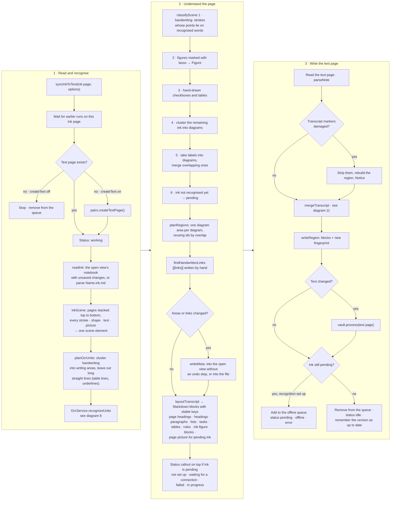
```mermaid
flowchart LR
  subgraph p1["1 · Read and recognise"]
    direction TB
    A["syncInkToText(ink page, options)"] --> L["Wait for earlier runs on this ink page"]
    L --> B{"Text page exists?"}
    B -- "no · createText off" --> X["Stop · remove from the queue"]
    B -- "no · createText on" --> B2["pairs.createTextPage()"]
    B -- yes --> C["Status: working"]
    B2 --> C
    C --> D["readInk: the open view's notebook<br/>with unsaved changes, or parse Name.ink.md"]
    D --> E["inkScene: pages stacked top to bottom,<br/>every stroke · shape · text · picture<br/>→ one scene element"]
    E --> F["planOcrUnits: cluster handwriting<br/>into writing areas, leave out long<br/>straight lines (table lines, underlines)"]
    F --> G["OcrService.recognizeUnits<br/>see diagram 8"]
  end

  subgraph p2["2 · Understand the page"]
    direction TB
    H1["classifyScene 1 · handwriting: strokes<br/>whose points lie on recognised words"]
    H2["2 · figures marked with lasso → Figure"]
    H3["3 · hand-drawn checkboxes and tables"]
    H4["4 · cluster the remaining ink into diagrams"]
    H5["5 · take labels into diagrams,<br/>merge overlapping ones"]
    H6["6 · ink not recognised yet → pending"]
    H1 --> H2 --> H3 --> H4 --> H5 --> H6
    H6 --> I["planRegions: one diagram area per diagram,<br/>reusing ids by overlap"]
    I --> J["findHandwrittenLinks:<br/>[[links]] written by hand"]
    J --> K{"Areas or links changed?"}
    K -- yes --> K2["writeMeta: into the open view without<br/>an undo step, or into the file"]
    K -- no --> M
    K2 --> M["layoutTranscript → Markdown blocks with stable keys<br/>page headings · headings · paragraphs · lists · tasks ·<br/>tables · rules · ink-figure blocks ·<br/>page picture for pending ink"]
    M --> N["Status callout on top if ink is pending<br/>not set up · waiting for a connection ·<br/>failed · in progress"]
  end

  subgraph p3["3 · Write the text page"]
    direction TB
    O["Read the text page · parseNote"] --> O2{"Transcript markers<br/>damaged?"}
    O2 -- yes --> O3["Strip them, rebuild the region, Notice"]
    O2 -- no --> P
    O3 --> P["mergeTranscript · see diagram 11"]
    P --> Q["writeRegion: blocks + new fingerprint"]
    Q --> R{"Text changed?"}
    R -- yes --> R2["vault.process(text page)"]
    R -- no --> S
    R2 --> S{"Ink still pending?"}
    S -- "yes, recognition set up" --> S2["Add to the offline queue<br/>status pending · offline · error"]
    S -- no --> S3["Remove from the queue · status idle ·<br/>remember the version as up to date"]
  end

  p1 --> p2 --> p3
```

---

## 8. Handwriting recognition of one writing area

`OcrService.recognizeUnits` (`src/obsidian/ocrService.ts`) and `azureClient.ts`. Only black strokes on white are sent – never the paper, PDF or typed text.

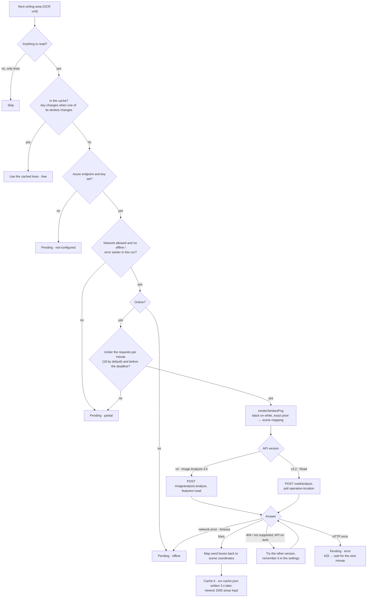
```mermaid
flowchart TD
  U["Next writing area (OCR unit)"] --> U0{"Anything to read?"}
  U0 -- "no, only lines" --> NX["Skip"]
  U0 -- yes --> C{"In the cache?<br/>key changes when one of its strokes changes"}
  C -- yes --> HIT["Use the cached lines · free"]
  C -- no --> CF{"Azure endpoint and key set?"}
  CF -- no --> PNC["Pending · not-configured"]
  CF -- yes --> NW{"Network allowed and no offline /<br/>error earlier in this run?"}
  NW -- no --> PP["Pending · partial"]
  NW -- yes --> ON{"Online?"}
  ON -- no --> POF["Pending · offline"]
  ON -- yes --> RL{"Under the requests per minute<br/>(18 by default) and before the deadline?"}
  RL -- no --> PP
  RL -- yes --> PNG["renderStrokesPng<br/>black on white, exact pixel ↔ scene mapping"]
  PNG --> API{"API version"}
  API -- "v4 · Image Analysis 4.0" --> V4["POST imageanalysis:analyze, features=read"]
  API -- "v3.2 · Read" --> V3["POST read/analyze,<br/>poll operation-location"]
  V4 --> RES{"Answer"}
  V3 --> RES
  RES -- "lines" --> MAP["Map word boxes back to scene coordinates"]
  MAP --> SAVE["Cache it · ocr-cache.json written 3 s later,<br/>newest 1500 areas kept"]
  RES -- "404 / not supported, API on auto" --> SW["Try the other version,<br/>remember it in the settings"]
  SW --> RES
  RES -- "network error · timeout" --> POF
  RES -- "HTTP error" --> PE["Pending · error<br/>429 → wait for the next minute"]
```

---

## 9. Page status and the offline queue

`SyncEngine.status` per ink page. The toolbar's **Text** button shows `…` while working, `◦` while waiting and `!` after an error; the text page's bookmark shows the same state. Pages with pending ink stay in `settings.queue` until they are transcribed.

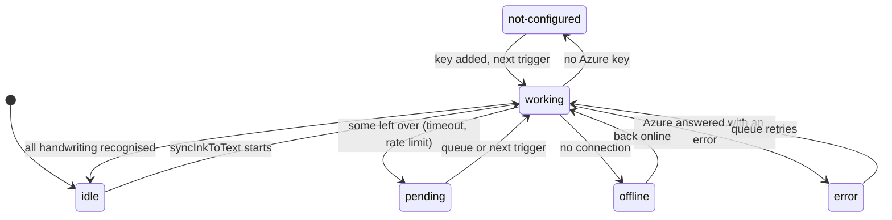
```mermaid
stateDiagram-v2
  state "not-configured" as notConfigured
  [*] --> idle
  idle --> working: syncInkToText starts
  working --> idle: all handwriting recognised
  working --> pending: some left over (timeout, rate limit)
  working --> offline: no connection
  working --> error: Azure answered with an error
  working --> notConfigured: no Azure key
  pending --> working: queue or next trigger
  offline --> working: back online
  error --> working: queue retries
  notConfigured --> working: key added, next trigger
```

---

## 10. Flipping between ink and text

`PageSwitcher.toText` / `toInk` (`src/obsidian/pageSwitcher.ts`), in the same tab.

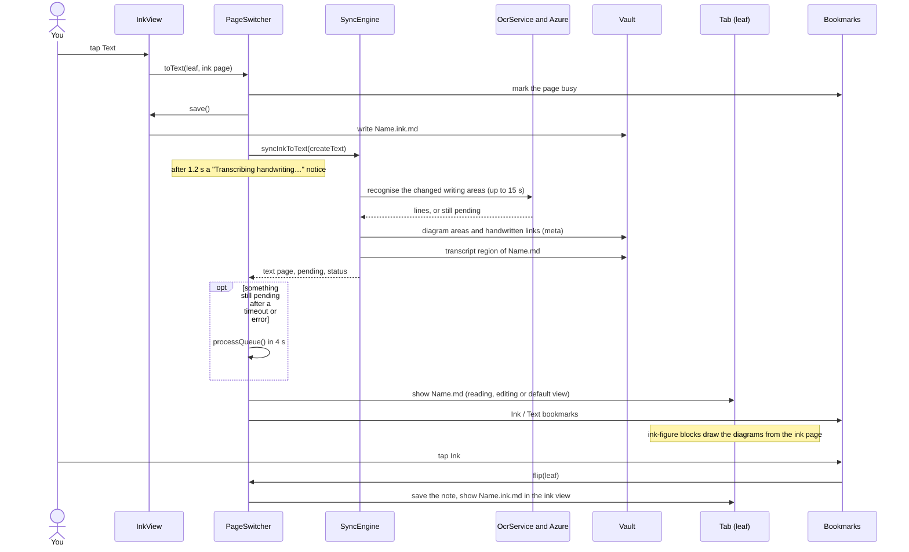
```mermaid
sequenceDiagram
  actor You
  participant IV as InkView
  participant PS as PageSwitcher
  participant SE as SyncEngine
  participant OCR as OcrService and Azure
  participant V as Vault
  participant Leaf as Tab (leaf)
  participant BM as Bookmarks

  You->>IV: tap Text
  IV->>PS: toText(leaf, ink page)
  PS->>BM: mark the page busy
  PS->>IV: save()
  IV->>V: write Name.ink.md
  PS->>SE: syncInkToText(createText)
  Note over PS: after 1.2 s a "Transcribing handwriting…" notice
  SE->>OCR: recognise the changed writing areas (up to 15 s)
  OCR-->>SE: lines, or still pending
  SE->>V: diagram areas and handwritten links (meta)
  SE->>V: transcript region of Name.md
  SE-->>PS: text page, pending, status
  opt something still pending after a timeout or error
    PS->>PS: processQueue() in 4 s
  end
  PS->>Leaf: show Name.md (reading, editing or default view)
  PS->>BM: Ink / Text bookmarks
  Note over Leaf: ink-figure blocks draw the diagrams from the ink page
  You->>BM: tap Ink
  BM->>PS: flip(leaf)
  PS->>Leaf: save the note, show Name.ink.md in the ink view
```

---

## 11. Keeping your edits on the text page

`mergeTranscript` (`src/core/transcript.ts`). Each generated block has a key made from its stroke ids; the end marker stores, per key, the hash of what was generated and of what was written.

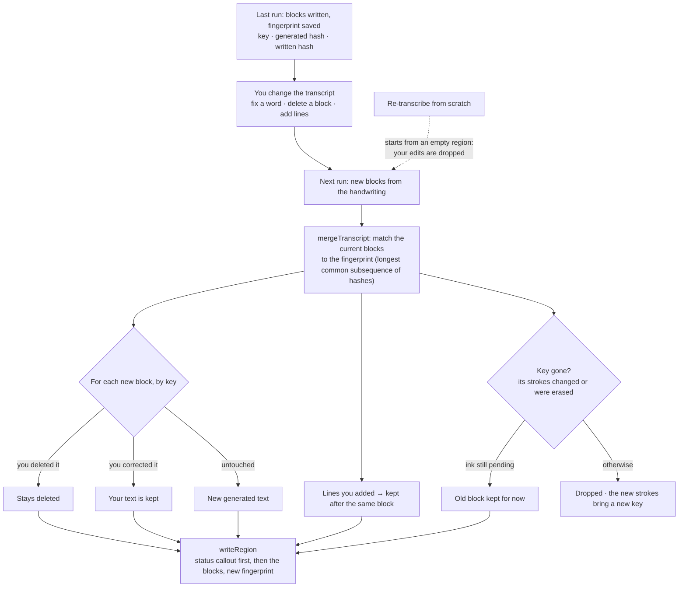
```mermaid
flowchart TD
  A["Last run: blocks written, fingerprint saved<br/>key · generated hash · written hash"] --> B["You change the transcript<br/>fix a word · delete a block · add lines"]
  B --> C["Next run: new blocks from the handwriting"]
  C --> D["mergeTranscript: match the current blocks<br/>to the fingerprint (longest common subsequence of hashes)"]
  D --> E{"For each new block, by key"}
  E -- "you deleted it" --> F1["Stays deleted"]
  E -- "you corrected it" --> F2["Your text is kept"]
  E -- "untouched" --> F3["New generated text"]
  D --> F4["Lines you added → kept after the same block"]
  D --> F5{"Key gone?<br/>its strokes changed or were erased"}
  F5 -- "ink still pending" --> F6["Old block kept for now"]
  F5 -- "otherwise" --> F7["Dropped · the new strokes bring a new key"]
  F1 --> W["writeRegion<br/>status callout first, then the blocks, new fingerprint"]
  F2 --> W
  F3 --> W
  F4 --> W
  F6 --> W
  RS["Re-transcribe from scratch"] -.->|"starts from an empty region:<br/>your edits are dropped"| C
```

---

## 12. The text page: live figures, bookmarks, typed notes

`src/obsidian/figureBlock.ts`, `bookmarks.ts`, `editorExtension.ts`, `notesPanel.ts`, `src/core/typedNotes.ts`.

### Drawings on the text page (`ink-figure` blocks)

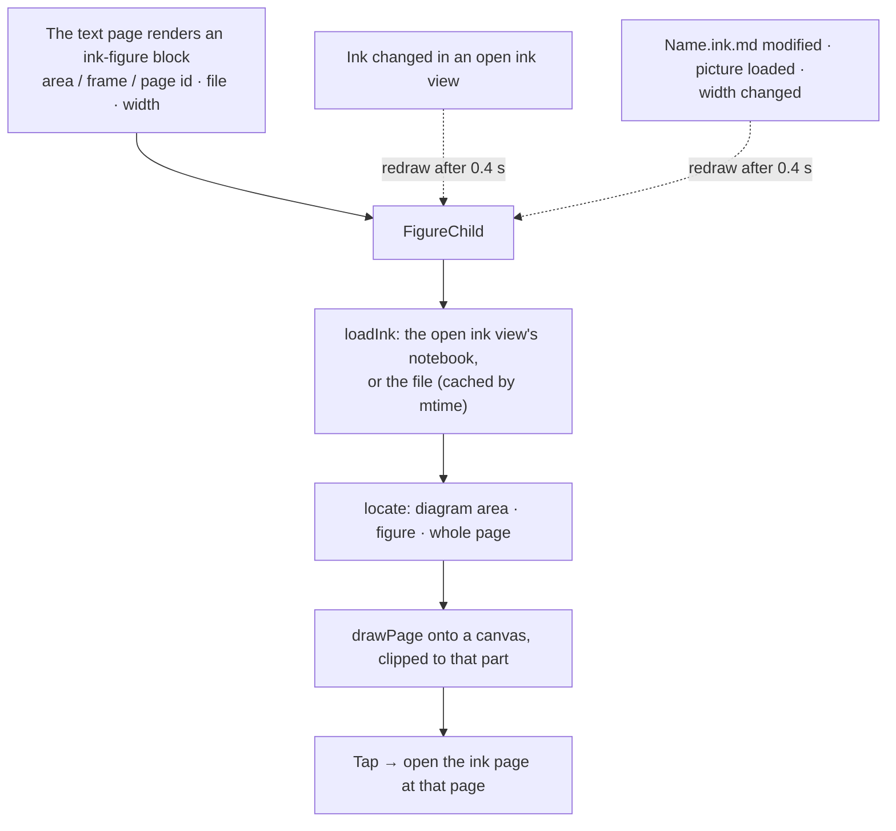
```mermaid
flowchart TD
  A["The text page renders an ink-figure block<br/>area / frame / page id · file · width"] --> B["FigureChild"]
  B --> C["loadInk: the open ink view's notebook,<br/>or the file (cached by mtime)"]
  C --> D["locate: diagram area · figure · whole page"]
  D --> E["drawPage onto a canvas, clipped to that part"]
  E --> F["Tap → open the ink page at that page"]
  R1["Ink changed in an open ink view"] -.->|"redraw after 0.4 s"| B
  R2["Name.ink.md modified · picture loaded ·<br/>width changed"] -.->|"redraw after 0.4 s"| B
```

### Typed notes, both ways

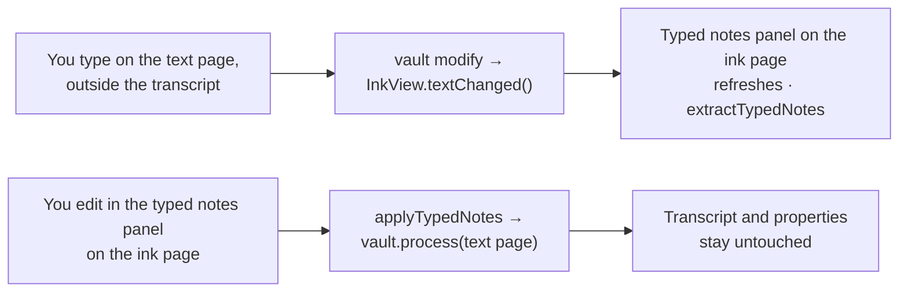
```mermaid
flowchart LR
  M["You type on the text page,<br/>outside the transcript"] --> N["vault modify →<br/>InkView.textChanged()"] --> O["Typed notes panel on the ink page<br/>refreshes · extractTypedNotes"]
  P["You edit in the typed notes panel<br/>on the ink page"] --> Q["applyTypedNotes →<br/>vault.process(text page)"] --> Q2["Transcript and properties<br/>stay untouched"]
```

### Around the text

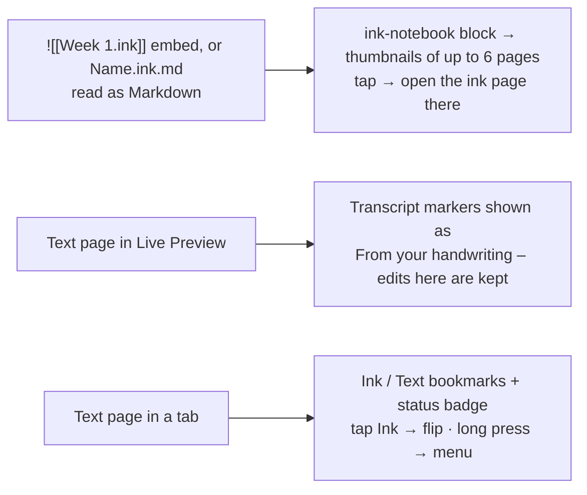
```mermaid
flowchart LR
  G["![[Week 1.ink]] embed, or Name.ink.md<br/>read as Markdown"] --> H["ink-notebook block → thumbnails of up to 6 pages<br/>tap → open the ink page there"]
  I["Text page in Live Preview"] --> J["Transcript markers shown as<br/>From your handwriting – edits here are kept"]
  K["Text page in a tab"] --> L["Ink / Text bookmarks + status badge<br/>tap Ink → flip · long press → menu"]
```

---

## 13. Creating ink pages

`PageSwitcher.createPage`, `addInkToNote` and `PairManager.attachDrawing` / `createTextPage`; daily notes in `src/obsidian/dailyNotes.ts`.

### A new ink page

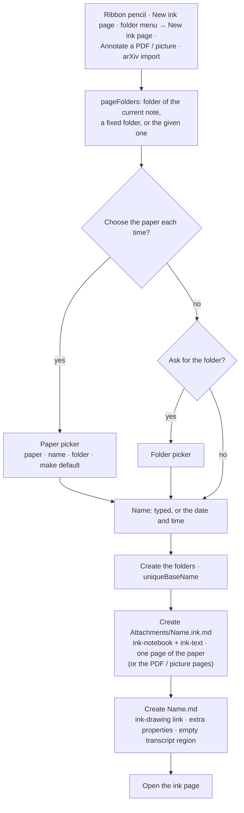
```mermaid
flowchart TD
  N1["Ribbon pencil · New ink page · folder menu → New ink page ·<br/>Annotate a PDF / picture · arXiv import"] --> N2["pageFolders: folder of the current note,<br/>a fixed folder, or the given one"]
  N2 --> N3{"Choose the paper each time?"}
  N3 -- yes --> N4["Paper picker<br/>paper · name · folder · make default"]
  N3 -- no --> N5{"Ask for the folder?"}
  N5 -- yes --> N6["Folder picker"]
  N5 -- no --> N7
  N4 --> N7["Name: typed, or the date and time"]
  N6 --> N7
  N7 --> N8["Create the folders · uniqueBaseName"]
  N8 --> N9["Create Attachments/Name.ink.md<br/>ink-notebook + ink-text · one page of the paper<br/>(or the PDF / picture pages)"]
  N9 --> N10["Create Name.md<br/>ink-drawing link · extra properties · empty transcript region"]
  N10 --> N11["Open the ink page"]
```

### Ink for a note you already have, daily notes

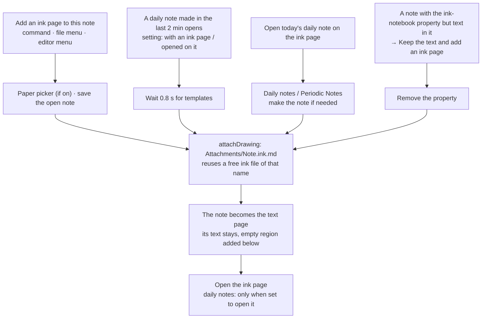
```mermaid
flowchart TD
  A1["Add an ink page to this note<br/>command · file menu · editor menu"] --> A2["Paper picker (if on) · save the open note"]
  D1["A daily note made in the last 2 min opens<br/>setting: with an ink page / opened on it"] --> D2["Wait 0.8 s for templates"]
  D3["Open today's daily note on the ink page"] --> D4["Daily notes / Periodic Notes<br/>make the note if needed"]
  K1["A note with the ink-notebook property but text in it<br/>→ Keep the text and add an ink page"] --> K2["Remove the property"]
  A2 --> A3["attachDrawing: Attachments/Note.ink.md<br/>reuses a free ink file of that name"]
  D2 --> A3
  D4 --> A3
  K2 --> A3
  A3 --> A4["The note becomes the text page<br/>its text stays, empty region added below"]
  A4 --> A5["Open the ink page<br/>daily notes: only when set to open it"]
```

### An ink page without a text page

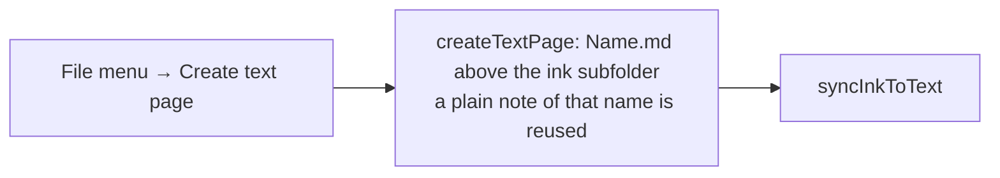
```mermaid
flowchart LR
  O1["File menu → Create text page"] --> O2["createTextPage: Name.md above the ink subfolder<br/>a plain note of that name is reused"] --> O3["syncInkToText"]
```

---

## 14. Renaming, moving and deleting

`InkNotebookPlugin.onRename`, `renameAsset`, `matchUpPages` and `PairManager.onRename` / `tidy`.

### Renaming or moving a file

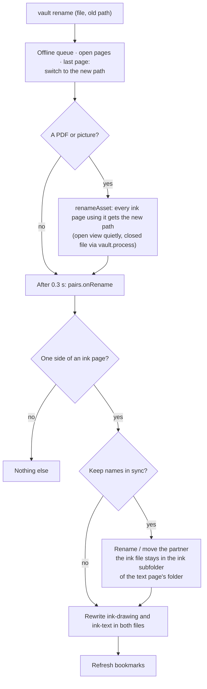
```mermaid
flowchart TD
  R["vault rename (file, old path)"] --> R1["Offline queue · open pages · last page:<br/>switch to the new path"]
  R1 --> R2{"A PDF or picture?"}
  R2 -- yes --> R3["renameAsset: every ink page using it gets the new path<br/>(open view quietly, closed file via vault.process)"]
  R2 -- no --> R4
  R3 --> R4["After 0.3 s: pairs.onRename"]
  R4 --> R5{"One side of an ink page?"}
  R5 -- no --> R9["Nothing else"]
  R5 -- yes --> R6{"Keep names in sync?"}
  R6 -- yes --> R7["Rename / move the partner<br/>the ink file stays in the ink subfolder<br/>of the text page's folder"]
  R6 -- no --> R8
  R7 --> R8["Rewrite ink-drawing and ink-text in both files"]
  R8 --> R10["Refresh bookmarks"]
```

### Deleting, changing, matching up names

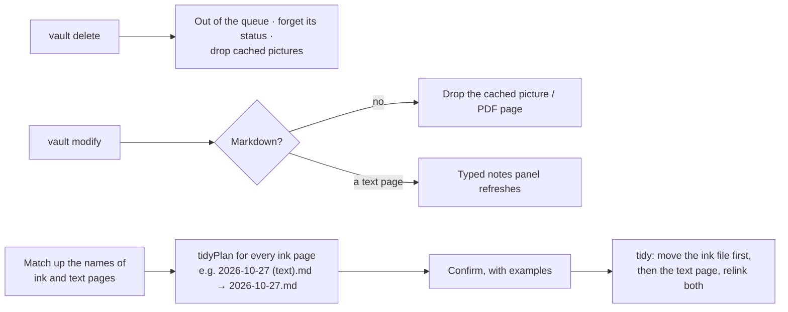
```mermaid
flowchart LR
  DEL["vault delete"] --> DEL1["Out of the queue · forget its status ·<br/>drop cached pictures"]
  MOD["vault modify"] --> MOD1{"Markdown?"}
  MOD1 -- no --> MOD2["Drop the cached picture / PDF page"]
  MOD1 -- "a text page" --> MOD3["Typed notes panel refreshes"]
  MU["Match up the names of<br/>ink and text pages"] --> MU1["tidyPlan for every ink page<br/>e.g. 2026-10-27 (text).md → 2026-10-27.md"] --> MU2["Confirm, with examples"] --> MU3["tidy: move the ink file first,<br/>then the text page, relink both"]
```

---

## 15. PDFs, pictures and papers from arXiv

`src/obsidian/pdfAnnotate.ts`, `papers.ts`, `paperSearch.ts`, `vaultImages.ts`, `src/core/arxiv.ts`, `src/core/pdfMath.ts`.

### Annotating a PDF or a picture

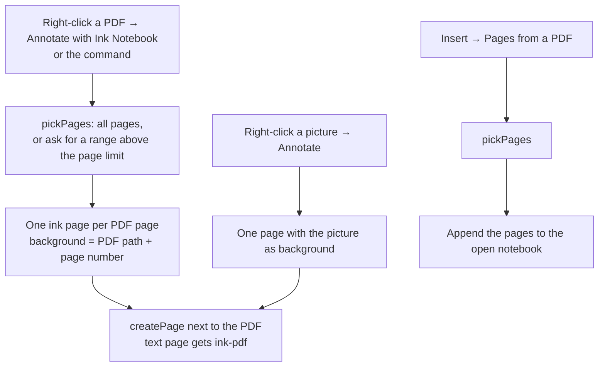
```mermaid
flowchart TD
  P1["Right-click a PDF → Annotate with Ink Notebook<br/>or the command"] --> P2["pickPages: all pages,<br/>or ask for a range above the page limit"]
  P2 --> P3["One ink page per PDF page<br/>background = PDF path + page number"]
  P3 --> P4["createPage next to the PDF<br/>text page gets ink-pdf"]
  I1["Right-click a picture → Annotate"] --> I2["One page with the picture as background"] --> P4
  P5["Insert → Pages from a PDF"] --> P6["pickPages"] --> P7["Append the pages to the open notebook"]
```

### Papers from arXiv

```mermaid
flowchart TD
  X1["Graduation cap · command ·<br/>Insert → Pages of a paper from arXiv"] --> X2["PaperSearchModal"]
  X2 --> X3{"Search text?"}
  X3 -- none --> X4["Popular papers<br/>huggingface.co daily papers"]
  X3 -- "words · au: · ti: · cat: · id or link" --> X5["arXiv API<br/>3 s between requests"]
  X4 --> X6["Cards: title · authors · date · abstract"]
  X5 --> X6
  X6 --> X7{"Imported before?"}
  X7 -- yes --> X8["Open"]
  X7 -- no --> X9["Import: download the PDF from arxiv.org"]
  X9 --> X10{"Into an open ink page?"}
  X10 -- yes --> X11["PDF next to it → append its pages"]
  X10 -- no --> X12["PDF into Papers/Attachments → pickPages → createPage<br/>properties: title · authors · arXiv id · link<br/>abstract above the transcript"]
```

### Showing and exporting

```mermaid
flowchart LR
  V1["VaultImages"] --> V2["Pictures from the vault"]
  V1 --> V3["PDF pages rendered with Obsidian's PDF.js<br/>at the shown resolution, one at a time"] --> V4["Ready → the page redraws"]
  E1["More → Export → Annotated PDF"] --> E2["pdf-lib loads the original and draws the ink<br/>on top as vectors · crop box and rotation mapped ·<br/>the PDF's text stays selectable"]
  E3["More → Export → The notebook as PDF"] --> E4["New PDF: paper · PDF pages · pictures · ink,<br/>all as vectors"]
  E5["More → Export → This page as an image"] --> E6["The page rendered to a PNG"]
```

---

## 16. Lasso actions, object library and Mermaid diagrams

`src/ink/selection.ts`, `src/obsidian/lassoText.ts`, `library.ts`, `mermaidModal.ts`, `src/core/ink/mermaid.ts`, `fromMermaid.ts`, `excalidrawLib.ts`.

### The bar above a lasso selection

```mermaid
flowchart LR
  L0["Lasso selection"] --> L1["Delete · Cut · Copy · Duplicate ·<br/>Colour · Fill"]
  L0 --> L2["Figure → always shown as a picture<br/>on the text page"]
  L0 --> L3["To text → only the selected strokes are recognised<br/>→ replaced by a typed text box (undo brings them back)"]
  L0 --> L4["To library → name it →<br/>My library.excalidrawlib"]
```

### The object library

```mermaid
flowchart TD
  S0["Library button · Insert → From the object library"] --> S1["LibraryService.sources()"]
  S1 --> S2["Flowchart<br/>built-in shapes in your pen and fill"]
  S1 --> S3["Mermaid<br/>notes in Ink libraries/Mermaid"]
  S1 --> S4["My library · every .excalidrawlib in the vault ·<br/>the Excalidraw plugin's library"]
  S7["Import a library file ·<br/>Import from a link"] --> S8["Saved into Ink libraries/"] --> S4
  S2 --> S5["Tap an item → stamp tool<br/>big items scaled to fit the page"]
  S3 --> S5
  S4 --> S5
  S5 --> S6["Tap the page → placeStamp<br/>as often as you like · another tool stops"]
```

### Mermaid diagrams

```mermaid
flowchart TD
  M1["Add a Mermaid diagram · Insert → Mermaid diagram ·<br/>right-click in a mermaid block · right-click a .mmd file"] --> M2["MermaidModal: paste · choose a file · pick a note<br/>live ink preview, errors with their line"]
  M2 --> M3["library.addMermaid<br/>mermaidToItems has to work first"]
  M3 --> M6["parse the flowchart → layered layout →<br/>shapes with labels · elbow arrows attached to shapes ·<br/>subgraph boxes"]
  M3 --> M4["Note with a mermaid block<br/>in Ink libraries/Mermaid/"]
  M4 --> M5["On an ink page: the library opens<br/>with it, ready to place"]
  M4 -.->|"change the note → the item changes"| M7["Mermaid section of the library"]
```

---

## 17. Settings, setup assistant and e-ink mode

`src/obsidian/settingsTab.ts`, `setupWizard.ts`, `einkMode.ts`, `src/core/device.ts`.

```mermaid
flowchart TD
  W0["First start · or Open setup assistant"] --> W1["1 · Your device and pen<br/>e-ink optimisations · finger drawing · side button"]
  W1 --> W2["2 · Handwriting → text, optional<br/>Azure endpoint + key · Test"]
  W2 --> W3["3 · Your pages<br/>folder · ink subfolder · paper"]
  W3 --> SAVE["saveSettings → data.json"]

  ST["Settings tab<br/>Writing · Pages · Recognition · Display · PDF · Libraries"] --> SAVE
  TB["Toolbar options · More → View<br/>toolbar position · whole page / page width"] --> SAVE
  TEST["Test connection"] --> TEST1["Tiny test image → v4, then v3.2 on auto<br/>remembers the working version"]

  SAVE --> AP["applyInkSettings()"]
  AP --> E1{"E-ink active?<br/>on · off · auto: Boox and other e-ink tablets<br/>detected from the user agent"}
  E1 -- yes --> E2["Body classes: black on white, no animations,<br/>large touch targets · low-latency canvas off"]
  E1 -- no --> E3["Normal look · low-latency canvas on (auto)"]
  AP --> E4["Every open InkView: surface.setSettings<br/>pressure · gestures · snap · scribble · fit · toolbar"]
  AP --> E5["Bookmarks refresh"]
  CSS["Theme or CSS changed"] --> AP
```

---

## 18. Converting pages made with Excalidraw

`src/obsidian/migrate.ts`, `src/core/ink/fromExcalidraw.ts` – for ink pages from versions up to 1.4.

```mermaid
flowchart TD
  A["Convert ink pages made with Excalidraw"] --> B["Find text pages that point at Name.excalidraw.md"]
  B --> C{"Any?"}
  C -- no --> C2["Notice: nothing to convert"]
  C -- yes --> D["Confirm"]
  D --> E["For each: read the Excalidraw scene"]
  E --> F["excalidrawToInk: pages · writing · shapes · text · pictures"]
  F --> G["Create Name.ink.md next to it"]
  G --> H["Point the text page's ink-drawing at it"]
  H --> I["syncInkToText → the text page's pictures are rewritten"]
  I --> J["Old .excalidraw.md files left as they are"]
```
